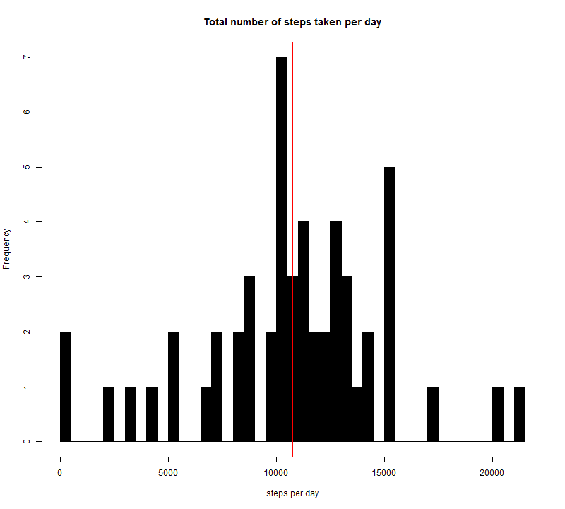
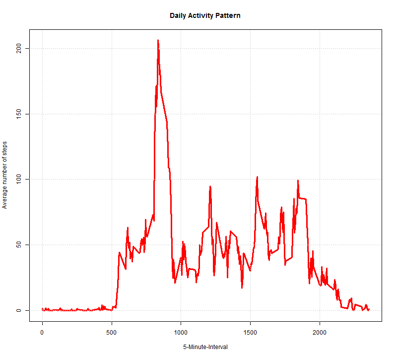
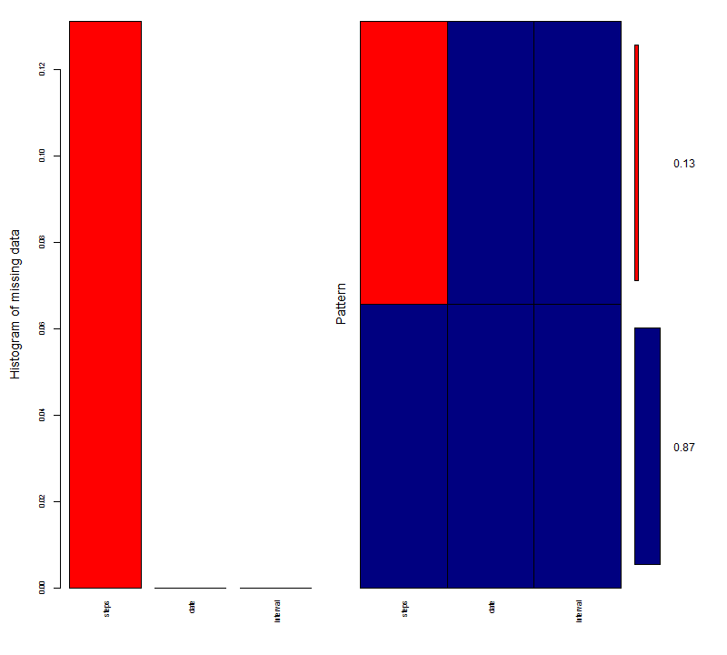
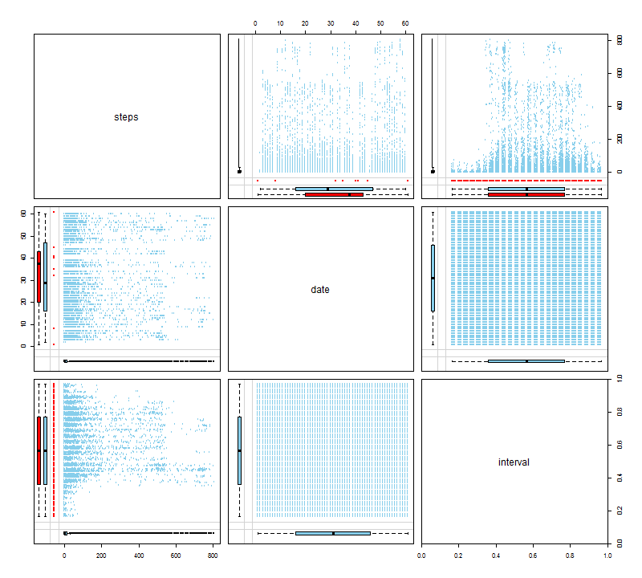
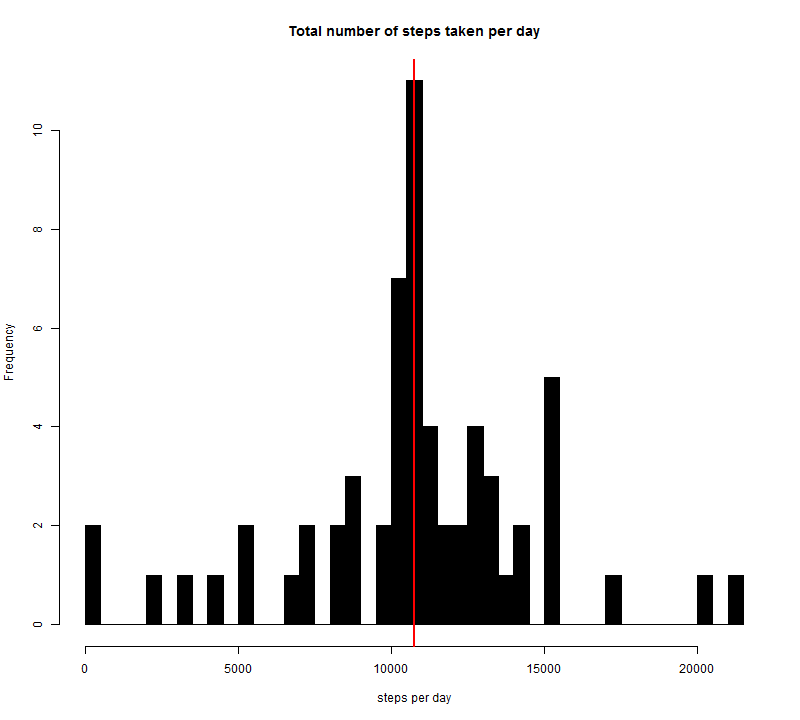
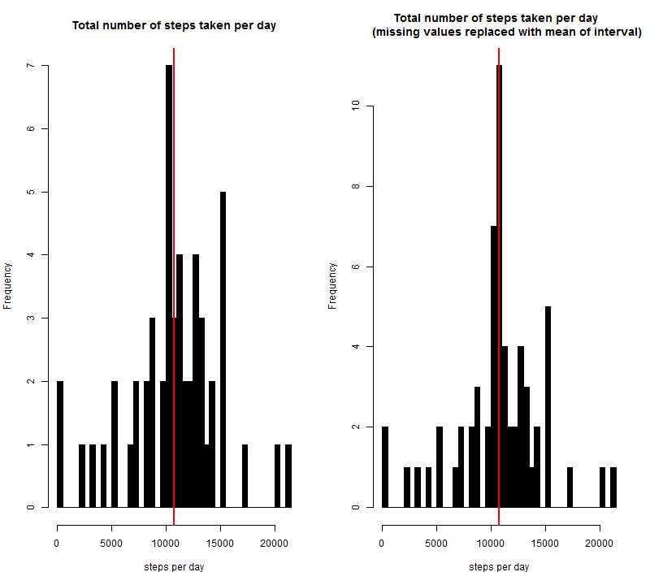
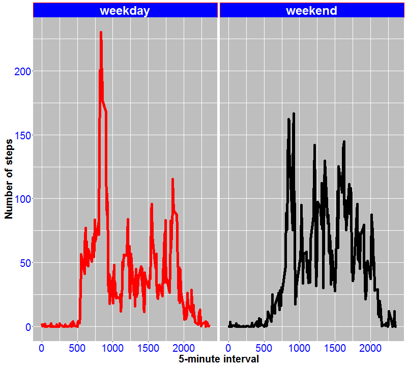

Reproducible Research: Peer Assessment 1
================

Loading and preprocessing the data
----------------------------------

``` r
require(ggplot2)

``` r
require(lubridate)


``` r
require(mice)
```

``` r
require(VIM)
```
``` r
# call packages
library(ggplot2)
library(lubridate)
library(mice)
library(VIM)
# 1_code for reading dataset and/or processing the data
# activity monitoring data
act.mon.data <- "https://d396qusza40orc.cloudfront.net/repdata%2Fdata%2Factivity.zip"
  
  # make sure the site is live, if it is not live stop function terminate the program
  check.url <- file(act.mon.data,"r")
  if (!isOpen(check.url)) {
    stop(paste("There's a problem with the data:",geterrmessage()))
  }
  # zipfile.data is the variable to keep the *.zip file
  zipfile.data = "repdata-data-activity.zip"
  
  # make sure the data in the working directory if not download the zip file into the to zipfile.data and unzip the zipfile.data
  if(!file.exists(zipfile.data)) {        
        download.file(act.mon.data,zipfile.data)
        data.file <- unzip(zipfile.data)
} else {
        data.file <-"activity.csv"
}

activity.mon.data <- read.csv(data.file)
str(activity.mon.data)
```

    ## 'data.frame':    17568 obs. of  3 variables:
    ##  $ steps   : int  NA NA NA NA NA NA NA NA NA NA ...
    ##  $ date    : Factor w/ 61 levels "2012-10-01","2012-10-02",..: 1 1 1 1 1 1 1 1 1 1 ...
    ##  $ interval: int  0 5 10 15 20 25 30 35 40 45 ...

What is mean total number of steps taken per day?
-------------------------------------------------

-   Missing values in the dataset are ignored.

``` r
new.activity.mon.data<-na.omit(activity.mon.data)
str(new.activity.mon.data)
```

    ## 'data.frame':    15264 obs. of  3 variables:
    ##  $ steps   : int  0 0 0 0 0 0 0 0 0 0 ...
    ##  $ date    : Factor w/ 61 levels "2012-10-01","2012-10-02",..: 2 2 2 2 2 2 2 2 2 2 ...
    ##  $ interval: int  0 5 10 15 20 25 30 35 40 45 ...
    ##  - attr(*, "na.action")=Class 'omit'  Named int [1:2304] 1 2 3 4 5 6 7 8 9 10 ...
    ##   .. ..- attr(*, "names")= chr [1:2304] "1" "2" "3" "4" ...

-   Total number of steps taken per day:

``` r
new.activity.mon.data$date<-as.Date(new.activity.mon.data$date) 
str(new.activity.mon.data) 
```

    ## 'data.frame':    15264 obs. of  3 variables:
    ##  $ steps   : int  0 0 0 0 0 0 0 0 0 0 ...
    ##  $ date    : Date, format: "2012-10-02" "2012-10-02" ...
    ##  $ interval: int  0 5 10 15 20 25 30 35 40 45 ...
    ##  - attr(*, "na.action")=Class 'omit'  Named int [1:2304] 1 2 3 4 5 6 7 8 9 10 ...
    ##   .. ..- attr(*, "names")= chr [1:2304] "1" "2" "3" "4" ...

``` r
per.day<-tapply(new.activity.mon.data$steps, new.activity.mon.data$date, FUN=sum)
```

``` r
# 2_Histogram of the total number steps taken each day
# picture size arrangements
number.add.width<-800
number.add.height<-720

png("plot1.png", width=number.add.width, height=number.add.height)
# lines(density(per.day)) #Get a density curve to go along with your AirPassengers histogram
# dev.off()
```

``` r
hist(per.day,53, main = "Total number of steps taken per day", xlab = "steps per day",col="black")
abline(v = mean(per.day), col = "red", lwd = 2)
```



-   Mean of the total number of steps taken per day

``` r
# 3_Mean and median number of steps taken each day
mean.per.day<-mean(per.day)
mean.per.day
```

    ## [1] 10766.19

-   Median of the total number of steps taken per day

``` r
median.per.day<-median(per.day)
median.per.day
```

    ## [1] 10765

What is the average daily activity pattern?
-------------------------------------------

-   Make a time series plot (i.e. type = "l") of the 5-minute interval (x-axis) and the average number of steps taken, averaged across all days (y-axis)

``` r
# 4_Time series plot of the average number of steps taken
daily.act.pattern<-tapply(new.activity.mon.data$steps, new.activity.mon.data$interval, FUN=mean)
# alternative solution for five.min.interval
five.min.interval.alt<-daily.act.pattern[match(max(daily.act.pattern),daily.act.pattern)]
#png("plot2.png", width=number.add.width, height=number.add.height)
#dev.off()
```

``` r
plot( x = names(daily.act.pattern),y = daily.act.pattern, type = "l", xlab = "5-Minute-Interval", 
    main = "Daily Activity Pattern", ylab = "Average number of steps",col="red",lwd=3)
grid()
```


-   On average across all the days in the dataset, the 5-minute interval contains the maximum number of steps?

``` r
# 5_The 5-minute interval that, on average, contains the maximum number of steps
five.min.interval<-daily.act.pattern[daily.act.pattern==max(daily.act.pattern)]
five.min.interval
```

    ##      835 
    ## 206.1698

Imputing missing values
-----------------------

-   Note that there are a number of days/intervals where there are missing values (coded as NA). The presence of missing days may introduce bias into some calculations or summaries of the data.

-   Calculate and report the total number of missing values in the dataset (i.e. the total number of rows with 'NA's)

``` r
md.pattern(activity.mon.data)
```

    ##       date interval steps     
    ## 15264    1        1     1    0
    ##  2304    1        1     0    1
    ##          0        0  2304 2304

``` r
#plot pattern
#png("plot3.png", width=number.add.width, height=number.add.height)

#dev.off()
#png("plot4.png", width=number.add.width, height=number.add.height)
#dev.off()
```

``` r
aggr_plot <- aggr(activity.mon.data, col=c('navyblue','red'), numbers=TRUE, sortVars=TRUE, labels=names(data), cex.axis=.7, gap=3, ylab=c("Histogram of missing data","Pattern"))
```


    ## 
    ##  Variables sorted by number of missings: 
    ##  Variable     Count
    ##     steps 0.1311475
    ##      date 0.0000000
    ##  interval 0.0000000

``` r
marginmatrix(activity.mon.data)
```


-   Devise a strategy for filling in all of the missing values in the dataset. The strategy does not need to be sophisticated. For example, you could use the mean/median for that day, or the mean for that 5-minute interval, etc.

-   Create a new dataset that is equal to the original dataset but with the missing data filled in.

``` r
new.activity.mon.data<-activity.mon.data
new.activity.mon.data[which(is.na(new.activity.mon.data$steps)),1]<-daily.act.pattern[as.character(new.activity.mon.data[which(is.na(new.activity.mon.data$steps)),3])]
# No missing values are now in the new dataset:
sum(is.na(new.activity.mon.data))
```

    ## [1] 0

``` r
# 6_Code to describe and show a strategy for imputing missing data
# Now let's make the same histogram, that we made in the first part of the analysis, in order to visually see if there is a big effect.
new.per.day <- tapply(new.activity.mon.data$steps, new.activity.mon.data$date, FUN=sum)
```

``` r
# 7_Histogram of the total number of steps taken each day after missing values are imputed
#png("plot5.png", width=number.add.width, height=number.add.height)
hist(new.per.day,53, main = "Total number of steps taken per day", xlab = "steps per day",col="black")
abline(v = mean(new.per.day), col = "red", lwd = 2)
```



``` r
#dev.off()
```

-   Mean of the total number of steps taken per day after imputed missing data

``` r
mean(new.per.day)
```

    ## [1] 10766.19

-   Median of the total number of steps taken per day after imputed missing data

``` r
median(new.per.day)
```

    ## [1] 10766.19

Compare the new mean, median values before imputed missing data:

``` r
mean(new.per.day)-mean(per.day)
```

    ## [1] 0

``` r
median(new.per.day)-median(per.day)
```

    ## [1] 1.188679

So, after imputing the missing data, the new mean of total steps taken per day is the same as that of the old mean; the new median of total steps taken per day is slightly greater than that of the old median.

-   Make a histogram of the total number of steps taken each day and Calculate and report the mean and median total number of steps taken per day.

``` r
# Comparison before imputed and after imputed
#png("plot6.png", width=number.add.width, height=number.add.height)
#dev.off()
```

``` r
par(mfrow=c(1,2))
hist(per.day,53, main = "Total number of steps taken per day", xlab = "steps per day",col="black")
abline(v = median(per.day), col = "red", lwd = 2)
hist(new.per.day,53, main = "Total number of steps taken per day  
     (missing values replaced with mean of interval)", xlab = "steps per day",col="black")
abline(v = median(new.per.day), col = "red", lwd = 2)
```


Are there differences in activity patterns between weekdays and weekends?
-------------------------------------------------------------------------

``` r
# 8_Panel plot comparing the average number of steps taken per 5-minute interval across weekdays and weekends
weekday.or.weekend <- function(date) {
    day <- weekdays(date)
    if (day %in% c("Monday", "Tuesday", "Wednesday", "Thursday", "Friday")) 
        return("weekday") else if (day %in% c("Saturday", "Sunday")) 
        return("weekend") else stop("invalid date")
}
new.activity.mon.data$date <- as.Date(new.activity.mon.data$date)
new.activity.mon.data$day <- sapply(new.activity.mon.data$date, FUN = weekday.or.weekend)

#png("plot7.png", width=number.add.width, height=number.add.height)
aggregated.avgs <- aggregate(steps ~ interval + day, data = new.activity.mon.data, mean)

weekday.aggregated.avgs <- subset(aggregated.avgs, day=="weekday")
weekend.aggregated.avgs <- subset(aggregated.avgs, day!="weekday")

c.y1<-max(weekend.aggregated.avgs$steps)
c.y2<-max(weekday.aggregated.avgs$steps)

c.x1<-weekend.aggregated.avgs$interval[match(c.y1,weekend.aggregated.avgs$steps)]
c.x2<-weekday.aggregated.avgs$interval[match(c.y2,weekday.aggregated.avgs$steps)]
#dev.off()
```

``` r
ggplot(aggregated.avgs, aes(interval, steps,color = day))+scale_colour_manual(values=c("red","black")) + geom_line(size=2) + facet_grid(. ~ day,scales = "free", space = "free") + 
    xlab("5-minute interval") + ylab("Number of steps")+theme(axis.text=element_text(size=20,colour="blue"),legend.position='none',
        axis.title=element_text(size=20,face="bold"),legend.background = element_rect(),panel.background = element_rect(fill = "grey"),strip.text.x = element_text(size=24, face="bold",colour="white"),
          strip.background = element_rect(colour="red", fill="blue"))
```


